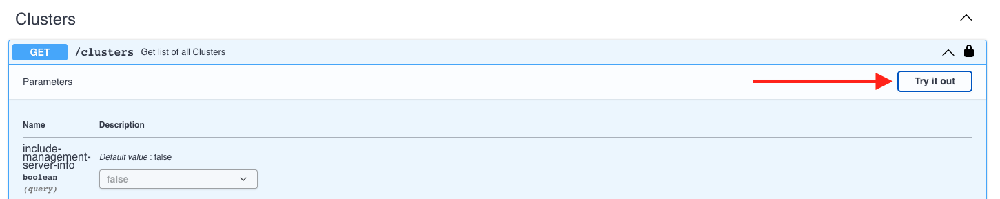
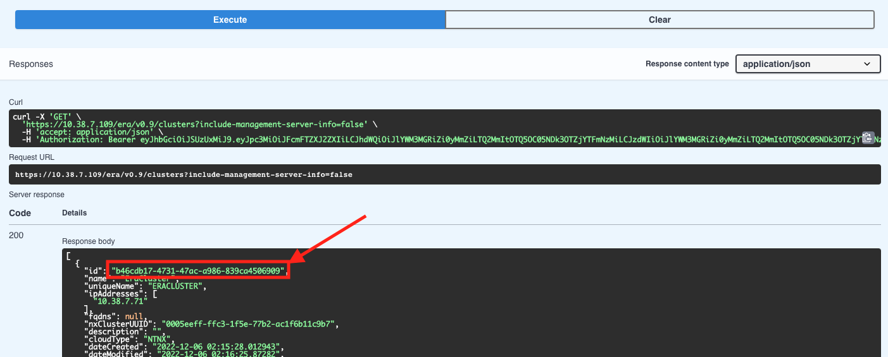
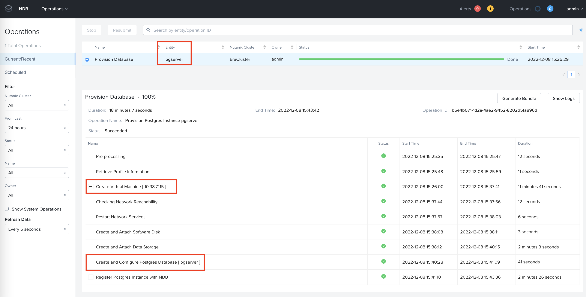

import Tabs from '@theme/Tabs';
import TabItem from '@theme/TabItem';

# OCP and Nutanix NDB

In this lab we will setup custom application with Nutanix Database [NDB](https://www.nutanix.com/products/database-service) service. 

In recent years, the growth of microservices has lead to use of VM based databases. Although microservices based databases are available,
customers are still using VM based databases as a datastore. The following may be the reason (but not limited to):

- Customer has majority of databases on VM platform 
- Customers DBA team has more expertise with VM based databases
- Cloud based database providers (AWS RDS) with several database engines are used prevalently
- Ease of deployment, scale and security (although security for microservices is improving at an exponential rate)
- Ease of providing high availability, disaster recovery and backups for these VM based databases
- Security of VMs in general 

Nutanix NDB offers Databases as a service using NDB. Cusotmers can provision hybrid multicloud DBaaS for Microsoft SQL Server, Oracle, PostgreSQL, MongoDB, and MySQL and be able to efficiently manage hundreds to thousands of databases.

:::note

Estimated time to complete this lab is 60 minutes.

:::

## Pre-requisites for using NDB Deployed Databases

- NDB appliance deployed on the Nutanix cluster
- OCP cluster deployed on the Nutanix cluster
- Networking requirements adhering to OCP and Nutanix

## High Level Overview of NDB and OCP integration

At a very high level we will perform the following steps:

1. Install NDB Operator on the OCP cluster - using helm 
2. Deploy a new NDB Postgres Database
3. Install a custom application on OCP
4. Connect application to NDB Postgres Database
   - Create database schema
   - Populate database with data 
5. Perform tasks at application level
6. Verify presence of data in NDB provisioned database

## Install NDB Operator on OCP

In this section we will install NDB operator and use yaml files to provision a database. The idea is simulate an environment where developers can create database resources as kubernets manifests.

This way developers can easily integrate VM based databases in their regular microservices based workflow.


1. Logon to your Linux Tools VM using root user name and password

2. Create a new directory in the home
   
   ```bash
   mkdir /root/ndb
   cd /root/ndb 
   ```
3. Clone NDB operator's git repository

   ```bash
   git clone https://github.com/nutanix-cloud-native/ndb-operator
   cd ndb-operator
   ```

4. Depending on you access to ``kubeconfig`` file or kubeadmin password, logon to the OCP cluster
   
    <Tabs groupId="Login Method">
    <TabItem value="kubeconfig file" label="kubeconfig">

    ```bash title="Export your kubeconfig file to env"
    export KUBECONFIG=/root/xyz/auth/kubeconfig
    ```

    </TabItem>
    <TabItem value="kubeadmin credentials" label="kubeadmin">

    ```bash title="Make sure to use your password"
    oc login -u kubeadmin -p UQVIT-7jBcB-VIQ9q-L2sNH
    ```

    </TabItem>
    </Tabs>

5. Make sure your OCP cluster is accesible

   ```bash
   oc get nodes
   ```

7. We will install go language to be able to deploy the software

   :::caution Go version?

   At the time of writing this lab Go was 1.19.3. 

   Make sure to download the stable version from [here](https://go.dev/doc/install).
   :::

   ```bash title="Download and install go"
   wget https://go.dev/dl/go1.18.8.linux-amd64.tar.gz
   rm -rf /usr/local/go && tar -C /usr/local -xzf go1.18.8.linux-amd64.tar.gz
   ```
   ```bash title="Make sure the downloaded file is healthy"
   sha256sum go1.18.8.linux-amd64.tar.gz
   ```
   ```bash title="Compare output to the hash in the download site"
   4d854c7bad52d53470cf32f1b287a5c0c441dc6b98306dea27358e099698142a  go1.18.8.linux-amd64.tar.gz
   ```
   ```bash title="Add go to path/env"
   export PATH=$PATH:/usr/local/go/bin
   source ~/.bash_profile
   ```
   ```bash title="Check go version"
   go version
   ```
   ```bash title="Install build tools"
   yum groupinstall "Development Tools"
   ```
   
6. Install the NDB Operator/Controller on OCP

    ```bash
    make deploy
    ```
    ```text title="Output - make sure there are no errors"
    /home/nutanix/ndb-operator/bin/controller-gen rbac:roleName=manager-role crd webhook paths="./..." output:crd:artifacts:config=config/crd/bases
    test -s /home/nutanix/ndb-operator/bin/kustomize || { curl -s "https://raw.githubusercontent.com/kubernetes-sigs/kustomize/master/hack/install_kustomize.sh" | bash -s -- 4.5.5 /home/nutanix/ndb-operator/bin; }
    cd config/manager && /home/nutanix/ndb-operator/bin/kustomize edit set image controller=ghcr.io/nutanix-cloud-native/ndb-operator/controller:v0.0.2
    /home/nutanix/ndb-operator/bin/kustomize build config/default | kubectl apply -f -
    namespace/ndb-operator-system created
    customresourcedefinition.apiextensions.k8s.io/databases.ndb.nutanix.com created
    serviceaccount/ndb-operator-controller-manager created
    role.rbac.authorization.k8s.io/ndb-operator-leader-election-role created
    clusterrole.rbac.authorization.k8s.io/ndb-operator-manager-role created
    clusterrole.rbac.authorization.k8s.io/ndb-operator-metrics-reader created
    clusterrole.rbac.authorization.k8s.io/ndb-operator-proxy-role created
    rolebinding.rbac.authorization.k8s.io/ndb-operator-leader-election-rolebinding created
    clusterrolebinding.rbac.authorization.k8s.io/ndb-operator-manager-rolebinding created
    clusterrolebinding.rbac.authorization.k8s.io/ndb-operator-proxy-rolebinding created
    configmap/ndb-operator-manager-config created
    service/ndb-operator-controller-manager-metrics-service created
    Warning: would violate PodSecurity "restricted:v1.24": unrestricted capabilities (containers "kube-rbac-proxy", "manager" must set securityContext.capabilities.drop=["ALL"]), seccompProfile (pod or containers "kube-rbac-proxy", "manager" must set securityContext.seccompProfile.type to "RuntimeDefault" or "Localhost")
    deployment.apps/ndb-operator-controller-manager created
    ```

## Create NDB Postgres DB 

1. Create a new OCP project
   
   ```bash
   oc new-project ndb
   ```

2. Create a secret to access NDB server

   ```bash
   cat << EOF > your-ndb-secret.yaml
   apiVersion: v1
   kind: Secret
   metadata:
     name: your-ndb-secret
   type: Opaque
   stringData:
     username: username-for-ndb-server
     password: password-for-ndb-server
   EOF
   ```
   ```bash title="Edit the manifest and apply it"
   vi your-ndb-secret.yaml
   oc apply -f your-ndb-secret.yaml
   ```
3. Create a secret with credentials (password and ssh public key) for the new Postgres VM that you will be provisioning
  
   ```bash
   cat << EOF > your-db-secret.yaml
   apiVersion: v1
   kind: Secret
   metadata:
     name: your-db-secret
   type: Opaque
   stringData:
     password: password-for-the-database-instance
     ssh_public_key: SSH-PUBLIC-KEY # >> this must be present
   EOF
   ```
   ```bash title="Edit the manifest and apply it"
   vi your-db-secret.yaml
   oc apply -f your-db-secret.yaml
   ```

4. We need to get the NDB server's cluster UUID to use in the next step; to facilitate this, logon to your NDB VM UI with the following credentials

   - **username** - admin
   - **password** - from your HPOC reservation
5. On the top right-hand corner, click on **admin** user name and select **REST API Explorer**

6. This will open a new browser tab

7. In the browser tab, scroll to the bottom to see **Clusters**

8. Expand the first GET / clusters API call and click on **Try it out**

   

9. Click on **Execute**

   

10. Copy the uuid shown here 

   

4. Create a Database resource by using the following manifest

   ```bash {12,18,24,27}
   cat << EOF > ndb_database.yaml
   apiVersion: ndb.nutanix.com/v1alpha1
   kind: Database
   metadata:
     # This name that will be used within the kubernetes cluster
     name: dbforflower
   spec:
     # NDB server specific details
     ndb:
       # Cluster id of the cluster where the Database has to be provisioned
       # Can be fetched from the GET /clusters endpoint
       clusterId: "a4cfc2cc-bd00-4cc6-95bd-5f714196db96" 
       # Credentials secret name for NDB installation
       # data: username, password, 
       # stringData: ca_certificate
       credentialSecret: your-ndb-secret
       # The NDB Server
       server: https://10.38.7.119:8443/era/v0.9
       # Set to true to skip SSL verification, default: false.
       skipCertificateVerification: true
     # Database instance specific details (that is to be provisioned)
     databaseInstance:
       # The database instance name on NDB
       databaseInstanceName: "pgserver"
       # Names of the databases on that instance
       databaseNames:
         - predictiondb
       # Credentials secret name for NDB installation
       # data: password, ssh_public_key
       credentialSecret: your-db-secret
       size: 10
       timezone: "UTC"
       type: postgres
   EOF
   ```

5. Edit the ``ndb_database.yaml`` file to populate with your environment details
   
   ```bash
   vi ndb_database.yaml
   ```

6. Create the NDB database
   
   ```bash
   oc apply -f ndb_database.yaml
   ```

7. Check the status of the deployment

   ```bash
   oc get database 
   ```
   ```text title="Output - you will see provisioning status"
   NAME          IP ADDRESS    STATUS           DATABASE INSTANCE ID                   DATABASE SERVER ID
   dbforflower      PROVISIONING
   ```  
8. You can also track the progress of the database deployment by looking at the ``ndb-operator-controller-manager`` pod logs in ``ndb-operator-system`` namespace

   ```bash title="Make sure to use your pod name"
   ocp logs pod/ndb-operator-controller-manager-56d475b4cc-7l9m -n ndb-operator-system -f
   ```

9. You can also login to the NDB web page to see the progress. 
   
   In NDB UI, Select **Menu** **Operations**

   


   
   
